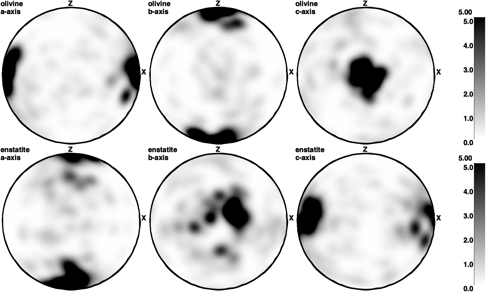

# Olivine Fabric Developments Under Simple Shear

*This section was contributed by Xiaochuan Tian, Yijun Wang and Menno Fraters. It is
based on a section in {cite:t}`fraters_billen_2021_cpo` 
by Menno Fraters and Magali Billen published in 2021.*

This cookbook explains how to set up a numerical experiment for rock fabric
developments of a single olivine particle under simple shear macroscopic strain. 
It uses ASPECT's
crystal preferred orientation implementation, which is described in detail in 
{cite:t}`fraters_billen_2021_cpo` and the paper is open accessed at 
[here](https://agupubs.onlinelibrary.wiley.com/doi/full/10.1029/2021GC009846).
The fabric calculation is based on DRex (Kaminski et al., 2004) at 
[here](https://academic.oup.com/gji/article/158/2/744/2013756).

## Motivation
The Earth's plates can move relative to each other because the underlying mantle
can flow/(be deformed) to accommodate such motions.
This flowing motion reflects dynamics inside the planet but cannot be observed directly
as the depth of interest is beyond human's drilling ability. However, indirect observation
from seismic anisotropy provides information about directionality of the speed of seismic
waves that propagate inside the Earth. If such directionality is controlled by
the mantle's motion/deformation, we can then use seismic anisotropy observations
to infer mantle's deformation.

People care about rock fabric developments under simple shear because it may
provide a bridge that links seismic anisotropy observations to the 
flows in the upper mantle that accommodate plate motions.

Olivine is the major mineral of the Earth's upper mantle where most deformation
takes place and we here focus on how olivine fabric develops under simple shear.

We prescribe simple shear in a 3d Cartesian box/cube 
with dimensions of $1 \times 1 \times 1 $ $[m^3]$. The shear strain rate 
$\dot{\epsilon}_{xz} = 5\times 10^{-6} [s^{-1}]$. The olivine particle is placed
right at the center of the cubic box so it can stay stationary.
Solid
material is flowing in from the bottom with a prescribed temperature and
melting due to decompression as is rises. The model is cooled from the top so
that melt freezes again as it approaches this boundary. In addition, a fixed
plate velocity away from the ridge axis is prescribed at the top boundary,
inducing corner flow. Material can flow out freely at the right model
boundary. The model shows both how melt is focused towards the ridge axis, and
how melting and freezing induces chemical heterogeneity in the mantle,
generating the crust and lithosphere. A movie of the full model evolution can
be found [online](https://www.youtube.com/watch?v=f4Bc4lzdNP0).

## The input file

One important problem in models with melting and freezing (and other
reactions) is that these reactions can be much faster than the time step of
the model. For mid-ocean ridges, melt is generally assumed to be in
equilibrium with the solid, which means that the reaction is basically
instantaneous. To model these type of processes, ASPECT uses operator splitting (see
also {ref}`sec:benchmark:operator-splitting`): Reactions are solved
on a different time scale than advection. For this model, this means that at
the beginning of each time step, all melting reactions, including their latent
heat effects, are solved using several shorter sub-time steps. In the input
file, we have to choose both the size of these sub-time steps and the rate (or
characteristic time scale) of melting, and they have to be consistent in the
sense that the operator splitting time step can not be larger than the
reaction time scale. The melting model we use here is the anhydrous mantle
melting model of {cite:t}`katz:etal:2003` for a peridotitic rock
composition, as implemented in the "melt simple" material model.

```{literalinclude} melting_and_freezing.part.prm
```

To make sure we reproduce the characteristic triangular melting region of a
mid-ocean ridge, we have to set up the boundary conditions in a way so that
they will lead to corner flow. At the top boundary, we can simply prescribe
the half-spreading rate, and at the left boundary we can use a free-slip
boundary, as material should not cross this centerline. However, we do not
know the inflow and outflow velocities at the bottom and right side of the
model. Instead, what we can do here is prescribing the lithostatic pressure as
a boundary condition for the stress. We accomplish this by using the
"initial lithostatic pressure" model. This plugin will
automatically compute a 1d lithostatic pressure profile at a given point at
the time of the model start and apply it as a boundary traction.

```{literalinclude} boundary_conditions.part.prm
```

Finally, we have to make sure that the resolution is high enough to model melt
migration. This is particularly important in regions where the porosity is
low, but still high enough that the two-phase flow equations are solved
(instead of the Stokes system, which is solved if there is no melt present in
a cell). At the boundary between these regions, material properties like the
compaction viscosity may jump, and there may be strong gradients or jumps in
some solution variables such as the melt velocity and the compaction pressure.
In addition, the characteristic length scale for melt transport, the
compaction length $\delta$, depends on the porosity:
```{math}
\delta = \sqrt{\frac{(\xi+4\eta/3)k}{\eta_f}}.
```

While the melt viscosity
$\eta_f$ is usually assumed to be constant, and the shear and compaction
viscosities $\eta$ and $\xi$ increase with decreasing porosity $\phi$, the
permeability $k \propto \phi^2$ or $k \propto \phi^3$ dominates this relation,
so that the compaction length becomes smaller for lower porosities. As the
length scale of melt migration is usually smaller than for mantle convection,
we want to make sure that regions where melt is present have a high
resolution, and that this high resolution extends to all cells where the
two-phase flow equations are solved.

```{literalinclude} mesh_refinement.part.prm
```

ASPECT also supports an alternative method to make sure that regions with melt are
sufficiently well resolved, relying directly on the compaction length, and we
will discuss this method as a possible modification to this cookbook at the
end of this section.

The complete input file is located at
[cookbooks/mid_ocean_ridge/mid_ocean_ridge.prm](https://www.github.com/geodynamics/aspect/blob/main/cookbooks/mid_ocean_ridge/mid_ocean_ridge.prm).

## Model evolution

```{figure-md} fig:mid-ocean-ridge


Mid-ocean ridge model after 8 million years. The top panel shows the depletion and porosity fields (with the characteristic triangular melting region), the bottom panel shows the temperature distribution and the melt velocity, indicated by the arrows.
```

When we look at the visualization output of this model (see also
{numref}`fig:mid-ocean-ridge`), we can see how the hot material flowing in from the bottom
starts to melt as it reaches lower and lower pressures and crosses the
solidus. Simultaneously, melting makes the residual solid rock more depleted
(as indicated by the positive values of the compositional field called
'peridotite'). Once material approaches the surface, it is cooled
from the cold boundary layer above, and melt starts to crystallize again,
generating 'enriched' basaltic crust where is freezes (as
indicated by the negative values of the compositional field called
'peridotite'). As the temperature gradients are much sharper close
to the surface, this transition from melt to solid rock is much sharper than
in the melting region. Once material crystallizes, it is transported away from
the ridge axis due to the flow field induced by the prescribed plate velocity
at the top boundary. This way, over time, the classical triangular melting
region develops at the ridge axis, and the material transported away from the
ridge shows two distinct layers: The top $\approx 7$ km are enriched material,
and form the basaltic crust (negative peridotite field), and the $\approx 50$
km below are depleted material, and form the lithosphere (positive peridotite
field). A vertical profile at a distance of 80 km from the ridge axis showing
this composition can be found in {numref}`fig:mid-ocean-ridge-profile`.

```{figure-md} fig:mid-ocean-ridge-profile


Vertical profile through the model domain at a distance of 80 km from the ridge axis at the end of the model run, showing the distribution of depletion and enrichment as indicated by the peridotite field.
```

## Mesh refinement

Another option for making sure that melt migration is resolved properly in the
model is using a refinement criterion that directly relates to the compaction
length. This can be done in the mesh refinement section of the input file:

```{literalinclude} compaction_length.part.prm
```

This will lead to a higher resolution particularly in regions with low (but
not zero) porosity, and can be useful to resolve the strong gradients in the
melt velocity and compaction pressure that are to be expected in these places
(see {numref}`fig:mid-ocean-ridge-mesh`). Of course it is also possible to combine both methods
for refining the mesh.

```{figure-md} fig:mid-ocean-ridge-mesh


Mesh after a time of 3.6 million years for a model using the composition threshold refinement strategy (left) and the compaction length refinement strategy (right) Background colors indicate the melt velocity. Its sharp gradients at the interface between regions with and without melt can only be resolved using the compaction length refinement strategy.
```

## Extending the model

There are a number of parameters that influence the amount of melting, how
fast the melt moves, and ultimately the distribution of crustal and
lithospheric material. Some ideas for adapting the model setup:

-   Changing the spreading rate: This can be done by choosing a different
    magnitude of the prescribed velocity at the top boundary, and influences
    the size and shape of the triangular melting region. Faster spreading
    allows hot material to move further away from the ridge axis, and hence
    facilitates a melting region that extends further in horizontal direction.

-   Changing the temperature profile: This can be done by choosing a different
    bottom boundary temperature and influences the amount of melting, and
    hence the thickness of the crust. Higher temperatures lead to more melt
    being generated.

-   Changing the speed of melt migration: The velocity of the melt with
    respect to the solid velocity is determined by the permeability and the
    melt viscosity (and the pressure gradients in the melt). Increasing the
    permeability (by setting a different "Reference permeability"
    in the melt simple model) can lead to higher melt velocities, melt
    reaching the depth of freezing faster, and hence lower overall porosity
    values at steady state.

-   Making the viscosity law more realistic: In this simple model, the
    viscosity only depends on the amount of melt that is present and is
    otherwise constant. This could be the reason why melt can not flow up all
    the way up at the ridge axis, but freezes before it reaches the surface.
    Introducing a temperature-dependent rheology could improve this behavior
    (and in reality, plastic effects might also play a role).

## References:
- Fraters, M. R. T., & Billen, M. I. (2021). 
On the implementation and usability of crystal preferred orientation evolution in geodynamic modeling. Geochemistry, Geophysics, Geosystems, 22(10), e2021GC009846.

- Kaminski, E., Ribe, N. M., & Browaeys, J. T. (2004). 
D-Rex, a program for calculation of seismic anisotropy due to crystal lattice preferred orientation in the convective upper mantle. Geophysical Journal International, 158(2), 744–752.
