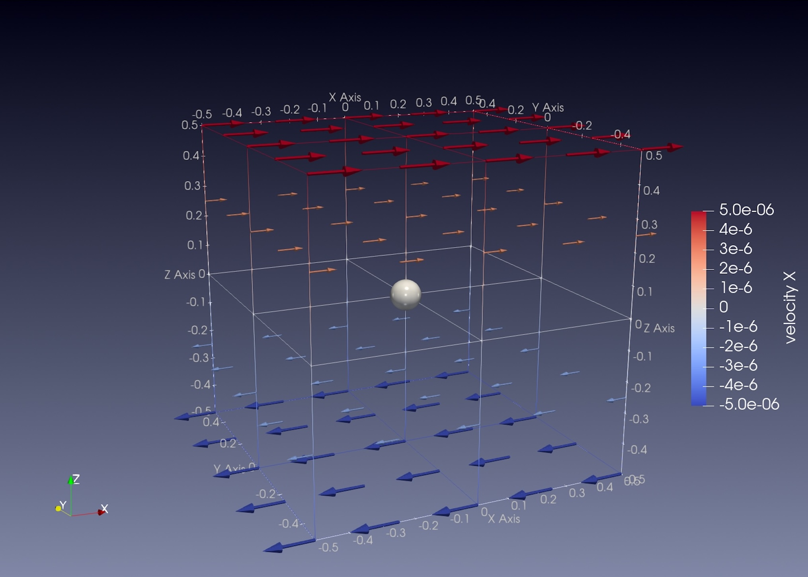
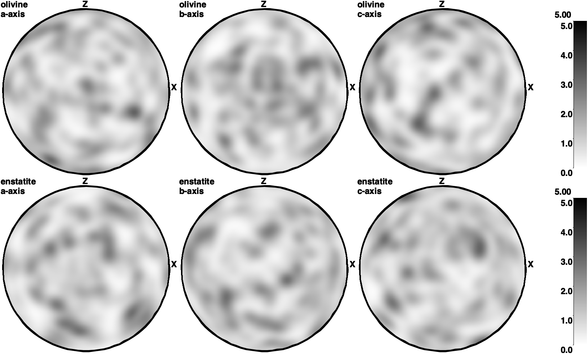
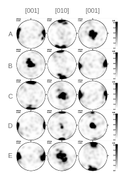

# Olivine Fabric Developments Under Simple Shear

*This section was contributed by Xiaochuan Tian, Yijun Wang and Menno Fraters. It is
based on a section in {cite:t}`fraters_billen_2021_cpo` 
by Menno Fraters and Magali Billen published in 2021.*

This cookbook explains how to set up a numerical experiment for fabric
developments of a single olivine particle under simple shear macroscopic strain. 
It uses ASPECT's
crystal preferred orientation (CPO) implementation, which is described in detail in 
{cite:t}`fraters_billen_2021_cpo` and the paper is open accessed at 
[here](https://agupubs.onlinelibrary.wiley.com/doi/full/10.1029/2021GC009846).
The fabric calculation is based on DRex (Kaminski et al., 2004) at 
[here](https://academic.oup.com/gji/article/158/2/744/2013756).
This notebook describe how to use ASPECT CPO implementation to calculate the major 
olivine fabrics observed in the lab experiments. It focuses on reproducing Fig. 3
of {cite}`fraters_billen_2021_cpo`.

### Motivation
The Earth's plates can move relative to each other because the underlying mantle
can flow/(be deformed) to accommodate such motions.
This flowing motion reflects dynamics inside the planet but cannot be observed directly
as the depth of interest is beyond human's drilling ability. However, indirect observation
from seismic anisotropy provides information about directionality of the speed of seismic
waves that propagate inside the Earth. If such directionality is controlled by
the mantle's motion/deformation, we can then use seismic anisotropy observations
to infer mantle's deformation.

Olivine is a major mineral of the Earth's upper mantle where continuous deformation
takes place. People care about olivine fabric developments under simple shear as it may
provide a bridge that links seismic anisotropy observations to the
flows in the upper mantle that accommodate plate motions. Indeed, high temperature and 
pressure lab experiments using Griggs apparatus to investigate olivine fabrics developments
under simple shear do find systematic types of fabrics based on the stress and water content conditions
(see Karato et al., 2008 for details). Here is a 
[link](https://doi.org/10.1146/annurev.earth.36.031207.124120) to the paper.

## Model setup

Following {cite:t}`fraters_billen_2021_cpo`, we prescribe simple shear in a 3d Cartesian box/cube
with dimensions of $1 \times 1 \times 1 $ $[m^3]$. The shear strain rate 
$\dot{\epsilon}_{xz} = -5\times 10^{-6} [s^{-1}]$. The olivine particle is placed
right at the center of the cubic box so it stays stationary. The DRex implementation
keep tracks of rotations of crystal grains within the particle under macroscopic deformation.

```{figure-md} fig:model_setup_3D_box

3D shear box with velocity vectors. The grey ball is the central olivine particle.
```

The model shows how crystal grains rotate and align under simple shear with pole figures.

## The input file

:::{tip}
Update the input file with update_prm_files.sh inside 
/aspect/contrib/utilities if the model doesn't run. 
See Pull Request #5873 
[conversations](https://github.com/geodynamics/aspect/pull/5873#issuecomment-2167145176) for detail.
:::

Instead of solving Stokes equation with initial and boundary conditions, we instead prescribe 
a constant simple shear strain rate field by setting Nonlinear solver scheme to 
"single Advecgion, no Stokes" and
prescribing the Stokes solution with a function. In this case, what we only care is the 
prescribed strain rate that is exerted onto the olivine particle. Parameters useful for the Stokes
equation is not important in this case. 

```{literalinclude} prescribe_stokes.part.prm
```

The second part of the input file specify what to output and what minerals to keep track of 
CPO development. It also specifies the parameters for the DRex algorithm. 

```{literalinclude} cpo.part.prm
```

The complete input file is located at
[/cookbooks/crystal_preferred_orientation_olivine_fraters_billen_2021/olivineA.prm](https://www.github.com/geodynamics/aspect/blob/main/cookbooks/crystal_preferred_orientation_olivine_fraters_billen_2021/olivineA.prm).

## Plotting pole figure

## Model results
```{figure-md} fig:initCPO


Initial randomized CPO at time zero.
```

```{figure-md} fig:olivine_fabrics


Olivine A-E type fabrics under simple shear with a shear strain of 1.5
at 3e5 seconds of model time under constant shear strain rate:
 $\dot{\epsilon}_{xz} = -5\times 10^{-6} [s^{-1}]$
```

When we look at the visualization output of this model (see also
{numref}`fig:olivine_fabrics`), we can see 


## Extending the model

There are a number of parameters that influence the amount of melting, how
fast the melt moves, and ultimately the distribution of crustal and
lithospheric material. Some ideas for adapting the model setup:

-   Changing the spreading rate: This can be done by choosing a different
    magnitude of the prescribed velocity at the top boundary, and influences
    the size and shape of the triangular melting region. Faster spreading
    allows hot material to move further away from the ridge axis, and hence
    facilitates a melting region that extends further in horizontal direction.

-   Changing the temperature profile: This can be done by choosing a different
    bottom boundary temperature and influences the amount of melting, and
    hence the thickness of the crust. Higher temperatures lead to more melt
    being generated.

-   Changing the speed of melt migration: The velocity of the melt with
    respect to the solid velocity is determined by the permeability and the
    melt viscosity (and the pressure gradients in the melt). Increasing the
    permeability (by setting a different "Reference permeability"
    in the melt simple model) can lead to higher melt velocities, melt
    reaching the depth of freezing faster, and hence lower overall porosity
    values at steady state.

-   Making the viscosity law more realistic: In this simple model, the
    viscosity only depends on the amount of melt that is present and is
    otherwise constant. This could be the reason why melt can not flow up all
    the way up at the ridge axis, but freezes before it reaches the surface.
    Introducing a temperature-dependent rheology could improve this behavior
    (and in reality, plastic effects might also play a role).

## References:
- Fraters, M. R. T., & Billen, M. I. (2021). 
On the implementation and usability of crystal preferred orientation evolution in geodynamic modeling. Geochemistry, Geophysics, Geosystems, 22(10), e2021GC009846.

- Kaminski, E., Ribe, N. M., & Browaeys, J. T. (2004). 
D-Rex, a program for calculation of seismic anisotropy due to crystal lattice preferred orientation in the convective upper mantle. Geophysical Journal International, 158(2), 744–752.

- Karato, S., Jung, H., Katayama, I., & Skemer, P. (2008). 
Geodynamic significance of seismic anisotropy of the upper mantle: New insights from laboratory studies. Annu. Rev. Earth Planet. Sci., 36, 59–95.
